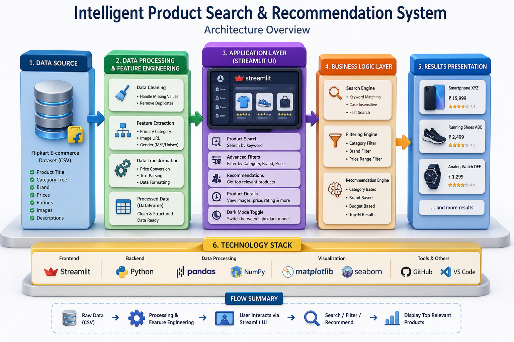

#  Intelligent Product Search & Recommendation System

An end-to-end **data-driven product discovery system** that simulates real-world e-commerce platforms using **search, filtering, and recommendation logic**.

---
##  Live Demo

[](https://intelligent-search.streamlit.app/)

##  System Architecture

```

<p align="center">
  
</p>


```
                ┌────────────────────┐
                │   User Interface   │
                │   (Streamlit UI)   │
                └─────────┬──────────┘
                          │
                          ▼
                ┌────────────────────┐
                │   Query Handling   │
                │ (Search / Filters) │
                └─────────┬──────────┘
                          │
                          ▼
                ┌────────────────────┐
                │ Data Processing    │
                │ - Cleaning         │
                │ - Feature Extract  │
                │ - Category Parsing │
                └─────────┬──────────┘
                          │
                          ▼
                ┌────────────────────┐
                │ Recommendation     │
                │ Engine             │
                │ - Category match   │
                │ - Brand filter     │
                │ - Price filter     │
                └─────────┬──────────┘
                          │
                          ▼
                ┌────────────────────┐
                │ Results Rendering  │
                │ (Cards + Images)   │
                └────────────────────┘
```

---

##  Features

###  Smart Search

* Keyword-based product search
* Case-insensitive matching
* Handles missing values safely

###  Advanced Filters

*  Price slider
*  Category dropdown
*  Brand dropdown
*  Sidebar filtering system

###  Recommendation System

* Category-based filtering
* Brand-based filtering
* Budget-aware suggestions
* Top-N product recommendations

###  Product Insights

* Product image
* Name
* Price
* Brand
* Category
* Gender classification
* ⭐ Exact rating (from dataset)

###  UI Features

* Dark mode 🌙
* Responsive layout
* Clean product cards
* Sidebar navigation

---

##  Tech Stack

### 🔹 Frontend

* Streamlit

### 🔹 Backend

* Python

### 🔹 Data Handling

* Pandas
* NumPy (dependency)

### 🔹 Visualization

* Matplotlib
* Seaborn

### 🔹 Data Processing Techniques

* Feature engineering
* Text parsing (`ast.literal_eval`)
* String matching
* Data cleaning

### 🔹 Dataset

* Flipkart E-commerce dataset

---

## 📂 Project Structure

```
intelligent-product-search/
│
├── app.py                  # Main Streamlit app
├── data_processing.py      # Data preprocessing logic
├── recommendation.py       # Recommendation engine
├── requirements.txt        # Dependencies
├── flipkart_com-ecommerce_sample.csv
└── README.md
```

---

##  Installation

```bash
git clone https://github.com/your-username/intelligent-product-search.git
cd intelligent-product-search

python -m venv venv
venv\Scripts\activate

pip install -r requirements.txt
python -m streamlit run app.py
```

---

##  Dataset Overview

Contains:

* Product name
* Category tree
* Prices (retail & discounted)
* Brand
* Description
* Image URLs
* Ratings

---

##  Core Modules

### 🔹 Data Processing

* Extract primary category
* Extract image URL
* Handle missing values
* Create gender feature

### 🔹 Search Engine

* String-based filtering
* Safe NaN handling

### 🔹 Recommendation Engine

* Multi-filter system:

  * Category
  * Brand
  * Price

---

##  Use Cases

* E-commerce search engines
* Product recommendation systems
* Data science portfolio project
* AI/ML application base

---

##  Future Enhancements

* NLP-based semantic search (BERT)
* ML recommendation system
* Personalized user recommendations
* Database integration
* Cloud deployment scaling

---

##  Author

**Jaswanth Reddy Bandi**

---

##  Support

If you like this project, give it a ⭐ on GitHub!

---
